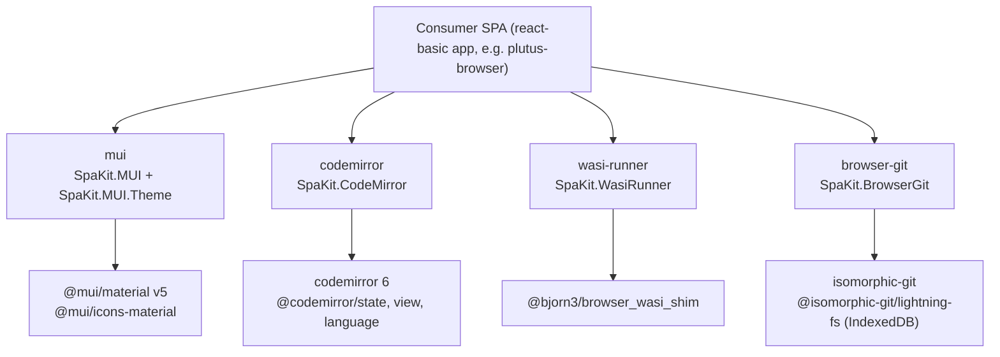

# purescript-spa-kit

Reusable PureScript browser SPA packages used by lambdasistemi apps.

## What is this

A Spago multi-package workspace of four small PureScript libraries, each
wrapping one browser JavaScript capability behind a typed FFI surface:

- `wasi-runner` — compile and run a WASI command-line program inside the
  browser via `@bjorn3/browser_wasi_shim`, capturing stdout/stderr.
- `mui` — thin `react-basic` bindings for Material UI v5 components, icons,
  and theme helpers (light/dark palette with localStorage persistence).
- `codemirror` — a `react-basic` CodeMirror 6 editor component with built-in
  UPLC (Untyped Plutus Core) syntax highlighting.
- `browser-git` — a thin `isomorphic-git` wrapper over persistent
  LightningFS (IndexedDB) storage: init, read, write-and-commit, per-file
  history, read-at-ref.

Each package is one PureScript module plus its FFI `.js` file. The
underlying JavaScript libraries are not bundled here: a consuming app must
add them to its own `package.json` so the FFI imports resolve at bundle
time (see [Install](#install)).

The packages are independent of each other — an app can pick any subset.
There are no executables and no test suites; CI checks formatting
(`purs-tidy`) and that the workspace builds.

## Architecture



## Install

Consume packages straight from this git repository as Spago
`extraPackages`, pinned to a commit, one entry per package (`subdir`
selects the package):

```yaml
# your app's spago.yaml
workspace:
  packageSet:
    registry: 72.1.0
  extraPackages:
    wasi-runner:
      git: https://github.com/lambdasistemi/purescript-spa-kit.git
      ref: <commit-sha>
      subdir: wasi-runner
    browser-git:
      git: https://github.com/lambdasistemi/purescript-spa-kit.git
      ref: <commit-sha>
      subdir: browser-git
```

Then add the JavaScript dependencies of the packages you use to your app's
`package.json` (versions as in this repo's [`package.json`](package.json)):

| Package | npm dependencies |
| --- | --- |
| `wasi-runner` | `@bjorn3/browser_wasi_shim` |
| `mui` | `@mui/material`, `@mui/icons-material`, `@emotion/react`, `@emotion/styled`, `react`, `react-dom` |
| `codemirror` | `codemirror`, `@codemirror/language`, `@codemirror/state`, `@codemirror/view`, `@lezer/highlight`, `react` |
| `browser-git` | `isomorphic-git`, `@isomorphic-git/lightning-fs`, `buffer` |

## Quickstart

A minimal `browser-git` session (your app also needs the `aff` and
`console` Spago dependencies):

```purescript
module Main where

import Prelude

import Effect (Effect)
import Effect.Aff (launchAff_)
import Effect.Class.Console as Console
import SpaKit.BrowserGit as Git

main :: Effect Unit
main = launchAff_ do
  repo <- Git.initRepo "quickstart" -- LightningFS namespace
  result <- Git.writeAndCommit repo "notes.md" "# Notes" "add notes"
  Console.log ("committed: " <> show result.committed <> " " <> result.oid)
  history <- Git.log repo "notes.md"
  Console.log (show (map _.message history))
```

Reloading the page and running this again reuses the same repository: the
write is detected as unchanged and `result.committed` is `false`.

## Usage

### `wasi-runner` — `SpaKit.WasiRunner`

```purescript
compileWasmModule :: WasmBytes -> Aff WasmModule
runWasmCli :: WasmModule -> Array String -> String -> Aff WasmCliResult

type WasmCliResult = { stdout :: String, stderr :: String, exitOk :: Boolean }
```

`WasmBytes` is a foreign type: hand it a `WebAssembly.Module`, an
`ArrayBuffer`, or a typed array from your own FFI (anything else throws).
Compilation results are cached per source buffer. `runWasmCli` takes the
argument vector and the full stdin text; stdout and stderr come back
line-buffered and newline-joined, and `exitOk` is `true` exactly when the
program exits with code 0.

### `mui` — `SpaKit.MUI` and `SpaKit.MUI.Theme`

Container components (`container`, `box`, `stack`, `paper`, `typography`,
`button`, `appBar`, `tabs`, `card`, `list`, `table`, `dialog`, …) have type
`forall r. Record r -> Array JSX -> JSX`; leaf components (`tab`,
`textField`, `switch`, `checkbox`, `chip`, `divider`, `circularProgress`,
…) and the 18 bundled icons have type `forall r. Record r -> JSX`. Props
records are passed to MUI untyped — spelling and value errors surface at
runtime, not compile time.

Theming: wrap the app in `themeProvider { theme: themeForMode mode }`
(plus `cssBaseline`); `themeForMode` accepts `"dark"` and treats anything
else as light. `SpaKit.MUI.Theme.initialThemeMode key` reads the saved mode
from localStorage, falling back to the OS `prefers-color-scheme`, and
`storeThemeMode key mode` persists a toggle.

Event helpers convert PureScript callbacks for common MUI `onChange`
shapes: `onTabChange (Int -> Effect Unit)`,
`onValueChange (String -> Effect Unit)`,
`onCheckedChange (Boolean -> Effect Unit)`.

### `codemirror` — `SpaKit.CodeMirror`

```purescript
codeEditor
  :: forall r
   . { value :: String, onChange :: String -> Effect Unit | r }
  -> JSX
```

A controlled CodeMirror 6 editor: external `value` changes replace the
document, edits fire `onChange` with the full text. An optional `ariaLabel`
prop labels the editor for screen readers. Syntax highlighting is fixed to
UPLC (keywords `program`, `lam`, `delay`, `force`, `con`, `builtin`,
`error`, `constr`, `case`; builtin type names; comments, numbers, strings,
`#hex` bytestrings).

### `browser-git` — `SpaKit.BrowserGit`

```purescript
initRepo :: String -> Aff BrowserRepo
listFiles :: BrowserRepo -> Aff (Array String)
readFile :: BrowserRepo -> String -> Aff String
writeAndCommit :: BrowserRepo -> String -> String -> String -> Aff WriteResult
log :: BrowserRepo -> String -> Aff (Array CommitInfo)
checkout :: BrowserRepo -> String -> String -> Aff String

type WriteResult = { oid :: String, committed :: Boolean }
type CommitInfo = { oid :: String, message :: String, timestamp :: String }
```

`initRepo namespace` opens (or creates, with default branch `main`) a git
repository at `/repo` inside a LightningFS store named `namespace` — the
store persists in IndexedDB across page reloads. `writeAndCommit path
content message` creates parent directories, writes the file, and commits
as author `Browser <browser@example.invalid>`; when the content is
unchanged it skips the commit and returns `committed: false` with the
current HEAD oid. `log path` returns the last 50 commits filtered to those
that changed the file (first message line, ISO-8601 timestamp). `checkout
path ref` does not touch the working tree: it returns the file's content
at the given commit. `storageBackend` is the constant `"lightning-fs"`.

## Documentation

For AI agents, start at [AGENTS.md](AGENTS.md).

## Development

```sh
nix develop   # purs, spago, purs-tidy 0.10.0, purescript-language-server, Node.js 22, just
just install  # npm ci
just build    # spago build
just ci       # install + format-check + build (what CI runs)
```

Formatting is `purs-tidy` over all four packages: `just format` to fix,
`just format-check` to verify. CI (GitHub Actions, `nixos` runner) builds
the dev shell and runs `nix develop --quiet -c just ci`.

The workspace uses Spago registry `72.1.0`. Keep `spago.lock` and
`package-lock.json` committed.
